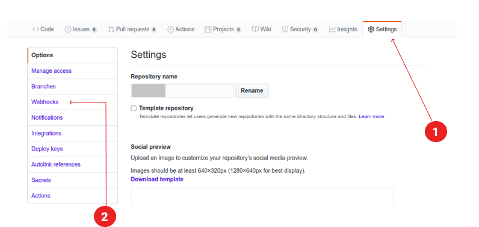
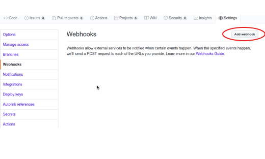
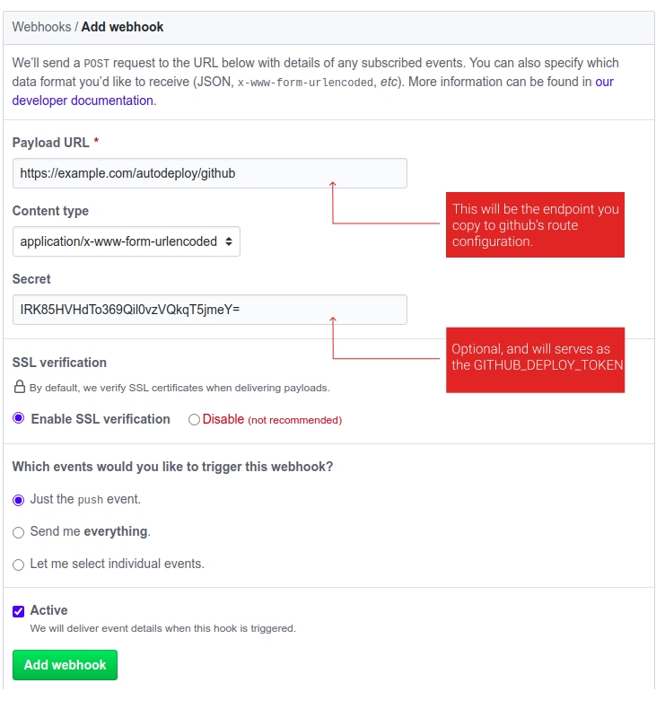

## Laravel Autodeploy.
Save yourself the stress of ssh-ing into your server everything you make a push to your
production or staging branch. Simply, have your servers, pick up the changes and run your deployment or
update scripts. It is as simple as ``echo "Hello World``. This package only works for Github and Bitbucket version control systems.


## Installation guide.
Require you having PHP and composer installed on your machine, and any Unix/Linux (or Mac) shell.

- Require the latest version of the package with composer
```shell script
composer require haqqman/autodeploy
```

- After installation, if you are using Laravel **5.5+**, you can move on unto the next step, otherwise you will have
to add the Service Provider manually. Open the file `config/app.php` and find the `providers` array. Add the line below
to the end of the array:
```php
Haqqman\Autodeploy\AutoDeployServiceProvider::class,
```

- You want to publish the configuration file (and maybe the auto deploy script we provide by default), run laravel artisan script
```shell script
php artisan vendor:publish --tag=autodeploy
```
When ran, you will see two files created for you, the `config/autodeploy.php` and `autodeploy.sh`. You can delete or 
modify the `autodeploy.sh` if you have your own script to run anytime the server pull some changes from your repository.

You will look into `config/autodeploy.php` to change the default settings we put in there.

## Configurations.
Note that any changes you will want to make will always go into the file `config/autodeploy.php`.
### Web Hooks
We support two VCS for now, [Github](https://github.com) and [Bitbucket](https://bitbucket.org). Your setup **webhook** on either one
will be listed in the routes array:
```php
 'routes' => [
        'github' => 'github-webhook',

        'bitbucket' => 'bitbucket-webhook'
    ],
```

### Email Notifications
If you want to get notified anytime the server(s) pick up changes from
your repositories, you will have to change the `subscribe` key to true 
and list email (or some emails) to send notifications to, in the config file.
You can list as many email as you want, and you can also change the template 
(`view`) that will be sent as email. 
> It is worthy to note that we leverage your Laravel SMTP settings, which means you must
>have configured your Mail settings working before enabling this feature.

### Security
Guarding your Web hooks, simply means that you have set a default token to be identified with
Github or Bitbucket request to your web hook endpoint on the server &mdash; and we encourage this.
It will limit the endpoint to only authorized party. If you have a `SECRET_TOKEN` set up, add them to your
`.env` file as either:
```dotenv
GITHUB_DEPLOY_TOKEN=secret_token_xxxx

BITBUCKET_DEPLOY_TOKEN=secret_token_xxxx
```
Any request made with mismatch token validation will be simply, rejected.


## Setting up Github Web Hook
Follow the guide to add a web hook for a repository.
- Navigate to settings Tab, and follow Webhooks link from the sidebar.


- Click on Add Webhook, if you don't have one already.


- Create the webhook.
